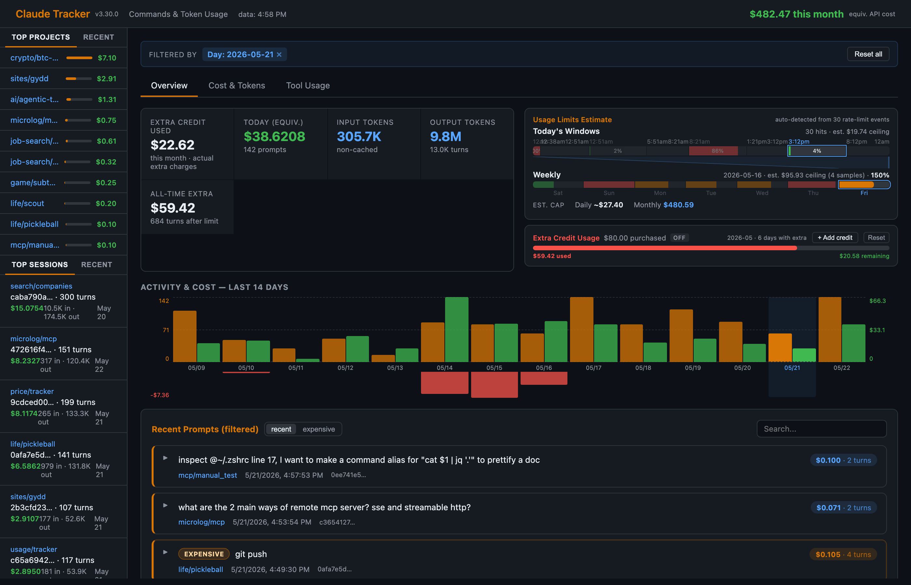
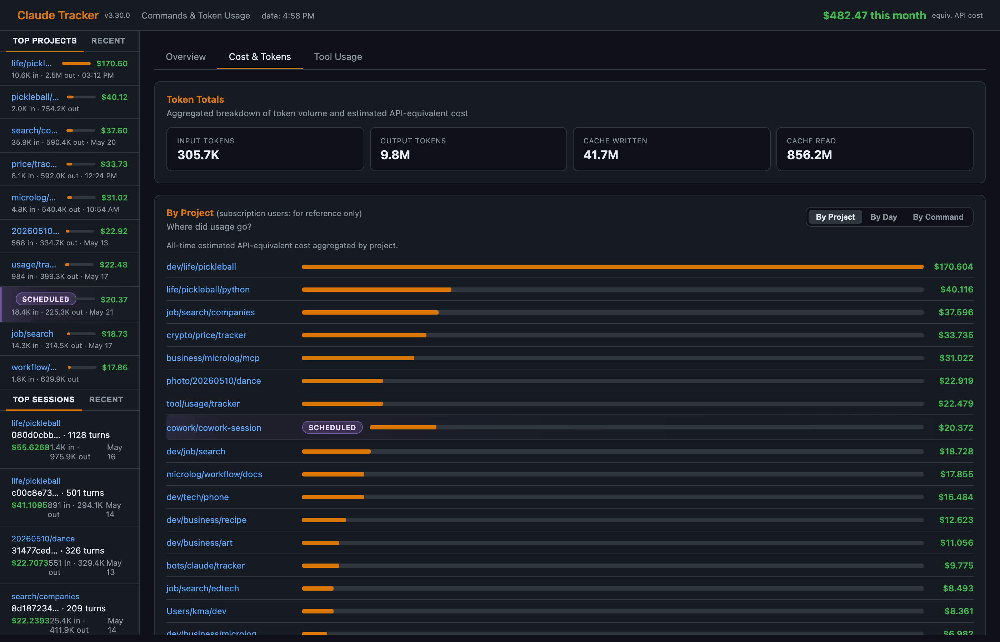
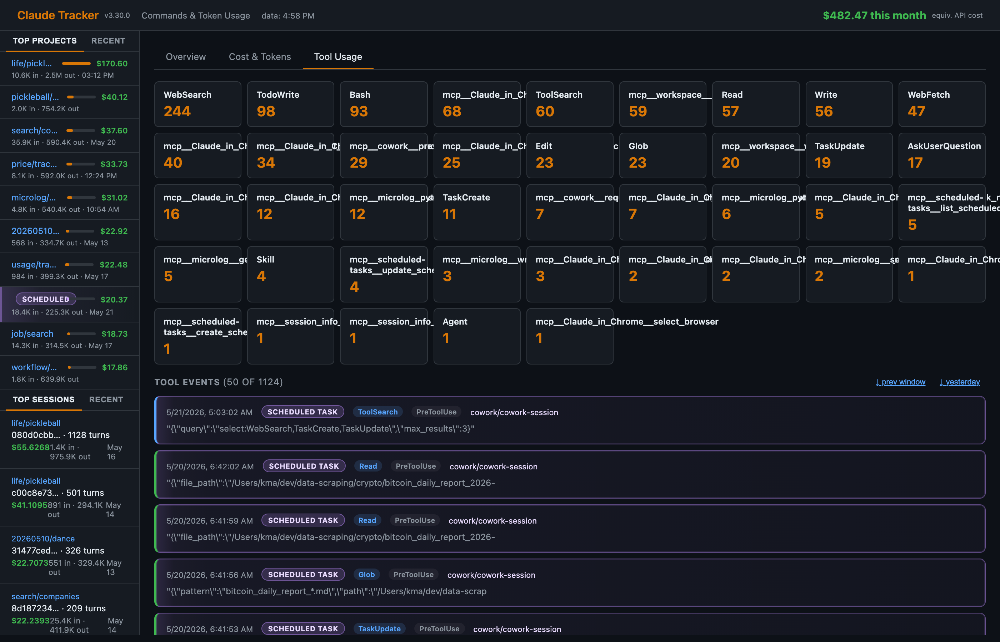
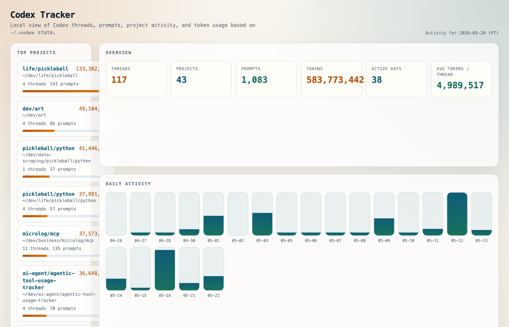
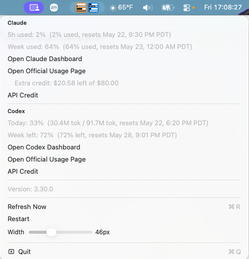

# Agentic Tool Usage Tracker

A self-hosted dashboard that tracks Claude Code and OpenAI Codex usage, token consumption, and estimated API-equivalent costs. Runs entirely locally — a Python hook logs events, a Node.js build script processes data, and a single HTML file renders everything in the browser.

Also includes a native macOS menu bar app showing live usage bars for both providers.



## Features

- Per-session and per-project token/cost breakdown
- Rate limit detection and usage window estimation
- Extra credit tracking
- Tool usage frequency (Claude Code)
- Claude Cowork scheduled-task integration
- Native macOS menu bar widget with usage bars for Claude and Codex

## Screenshots

### Claude Dashboard





### Codex Dashboard



### Menu Bar



## Prerequisites

- macOS (menu bar app requires macOS 13+)
- [Node.js](https://nodejs.org/) (v18+) — `brew install node`
- Python 3 — included with macOS or `brew install python`
- Swift toolchain — included with Xcode or `xcode-select --install` (menu bar only)
- Claude Code CLI

## Installation

### 1. Clone the repo

```bash
git clone https://github.com/your-username/ai-tools-usage-tracker.git
cd ai-tools-usage-tracker
```

### 2. Wire up Claude Code hooks

Add the following to `~/.claude/settings.json` (merge with any existing hooks):

```json
{
  "hooks": {
    "PreToolUse":      [{"matcher": "", "hooks": [{"type": "command", "command": "python3 /path/to/ai-tools-usage-tracker/claude/scripts/log_hook.py"}]}],
    "PostToolUse":     [{"matcher": "", "hooks": [{"type": "command", "command": "python3 /path/to/ai-tools-usage-tracker/claude/scripts/log_hook.py"}]}],
    "Notification":    [{"matcher": "", "hooks": [{"type": "command", "command": "python3 /path/to/ai-tools-usage-tracker/claude/scripts/log_hook.py"}]}],
    "UserPromptSubmit":[{"matcher": "", "hooks": [{"type": "command", "command": "python3 /path/to/ai-tools-usage-tracker/claude/scripts/log_hook.py"}]}]
  }
}
```

Replace `/path/to/ai-tools-usage-tracker` with the actual path.

### 3. Build the dashboard data

```bash
npm run build
```

Then open `claude/report.html` or `codex/report.html` in your browser.

### 4. (Optional) Build and run the menu bar app

```bash
npm run menubar:build
npm run menubar
```

Or install as a launch agent so it starts automatically at login:

```bash
./install_launch_agent.sh
```

## Usage

```bash
npm run build          # One-shot build of both dashboards
npm run watch:claude   # Auto-rebuild Claude dashboard on file changes
npm test               # Run all tests
npm run menubar        # Start menu bar app (must be built first)
npm run menubar:build  # Build menu bar app
npm run menubar:restart # Kill and restart the menu bar app
```

Open `claude/report.html` or `codex/report.html` in any browser after building.

## Configuration

Copy the example config (optional) to tune estimates:

```bash
cp claude/data/config.example.json claude/data/config.json
```

```json
{
  "plan": "pro",
  "extraPurchasedSeed": null,
  "extraSpentOverride": null,
  "weeklyLimitSeed": null,
  "windowLimitSeed": null
}
```

| Field | Description |
|---|---|
| `plan` | Your Claude plan: `"pro"`, `"max5x"`, or `"max20x"` — sets default usage ceilings |
| `extraPurchasedSeed` | Default extra credit purchased (USD), used as browser localStorage fallback |
| `extraSpentOverride` | Override transcript-derived extra credit spend (USD) |
| `weeklyLimitSeed` | Override estimated weekly ceiling (USD) |
| `windowLimitSeed` | Override estimated per-window ceiling (USD) |

## Architecture

```
~/.claude/settings.json   hooks: PreToolUse, PostToolUse, Notification, UserPromptSubmit
        |
        v
claude/scripts/log_hook.py    Appends events to data/events.jsonl, triggers rebuild
        |
        v
claude/scripts/build.js       Reads transcripts + history + events, writes data.js
        |
        v
claude/report.html + data.js  Static dashboard, open in any browser
```

## Tests

```bash
npm test
```

39 JS tests (`claude/test/build.test.js`) + 7 Python tests (`claude/test/log_hook.test.py`).

## License

MIT
